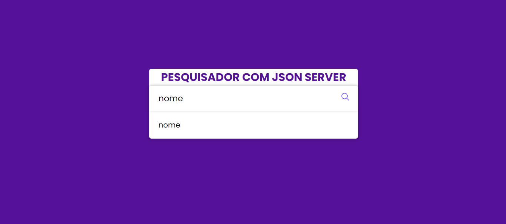
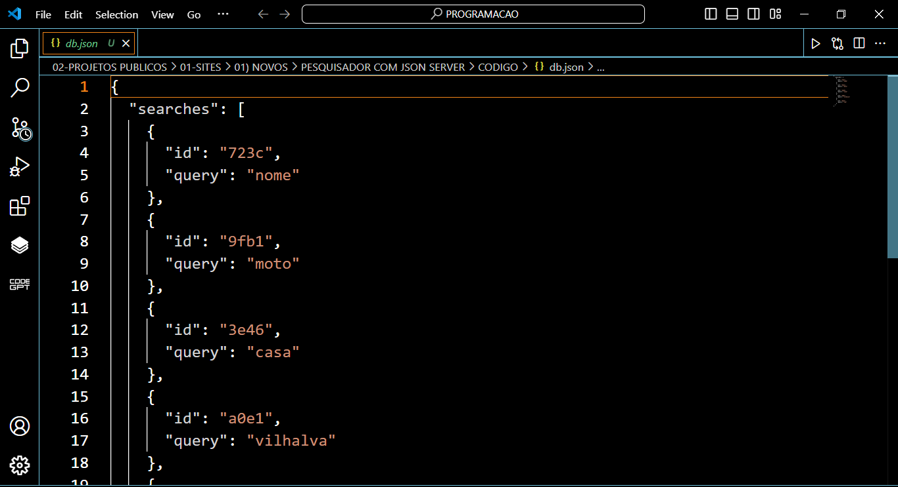
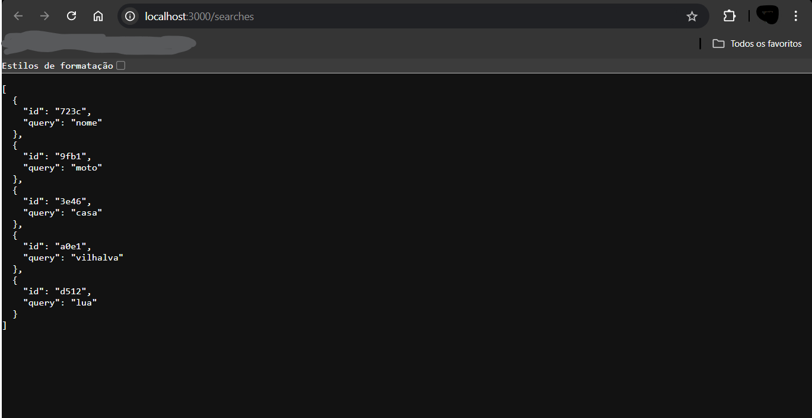

# PESQUISADOR COM JSON SERVER
👨‍🏫BUSCADOR COM SUGESTÃO VIA DATABASE JSON!

 <br>
 <br>
 <br>

## DESCRIÇÃO:
Este aplicativo fornece uma barra de pesquisa com funcionalidade de autocomplete, permitindo que os usuários realizem pesquisas de forma rápida e eficiente. O autocomplete sugere resultados com base em entradas anteriores armazenadas em um servidor JSON local.

## FUNCIONALIDADES:
1. **Autocomplete em Tempo Real:**
   - À medida que o usuário digita na barra de pesquisa, o aplicativo sugere resultados que correspondem às palavras digitadas, com base nas pesquisas armazenadas.

2. **Pesquisa via Google:**
   - O usuário pode clicar no ícone de pesquisa para abrir uma nova aba no navegador com os resultados da pesquisa do Google, utilizando a consulta digitada.

3. **Armazenamento de Pesquisas:**
   - As pesquisas realizadas são salvas em um servidor JSON local (usando JSON Server), evitando a duplicação de pesquisas já armazenadas.

4. **Sugestões Baseadas em Histórico:**
   - As sugestões apresentadas no autocomplete são filtradas com base nas consultas salvas no banco de dados JSON.

## EXECUTANDO O PROJETO:
1. **Instalar as dependências do projeto**:
   - Execute o comando no diretório `CODIGO/`:
     ```cmd
     npm install
     ```
   
   - Este comando instala todas as dependências listadas no arquivo `package.json` do seu projeto. Certifique-se de estar no diretório do seu projeto ao executar este comando.

2. **Executando o Aplicativo:**
   - Para subir o servidor, no diretório do seu [projeto](./CODIGO), abra outro Terminal/CMD e digite o seguinte comando:
   ```bash
   npm start
   ```

   - Acesse o APP no navegador visitando [http://127.0.0.1:8080/](http://127.0.0.1:8080/)

3. **Interagir com a Barra de Pesquisa:**
   - Digite um termo na barra de pesquisa. As sugestões correspondentes serão exibidas com base nas consultas salvas no banco de dados JSON.

4. **Selecionar Sugestões:**
   - Clique em uma sugestão para preenchê-la automaticamente na barra de pesquisa.

5. **Realizar uma Pesquisa:**
   - Após digitar ou selecionar uma sugestão, clique no ícone de pesquisa para abrir uma nova aba com os resultados da pesquisa no Google.

6. **Salvar Pesquisas:**
   - Ao clicar no ícone de pesquisa ou ao selecionar uma sugestão, a pesquisa será salva no servidor JSON local, se ainda não estiver presente.

7. **Visualizar Sugestões:**
   - As sugestões são atualizadas em tempo real enquanto você digita, com base nas pesquisas armazenadas no banco de dados JSON.

8. **Verifique o Armazenamento:**
   - Verifique o `./CODIGO/db.json` para ver as pesquisas salvas. ou acesse no navegador: [http://localhost:3000/searches](http://localhost:3000/searches).

## TECNOLOGIAS USADAS:
* [HTML E CSS](https://github.com/VILHALVA/CURSO-DE-HTML-E-CSS)
* [JAVASCRIPT](https://github.com/VILHALVA/CURSO-DE-JAVASCRIPT)
* [NODEJS](https://github.com/VILHALVA/CURSO-DE-NODEJS)
* [JSON SERVER](https://github.com/VILHALVA/CURSO-DE-JSON-SERVER)

## CREDITOS:
- [PROJETO BASEADO NO "BUSCADOR AUTOCOMPLETE"](https://github.com/VILHALVA/BUSCADOR-AUTOCOMPLETE)
- [PROJETO FEITO PELO VILHALVA](https://github.com/VILHALVA)